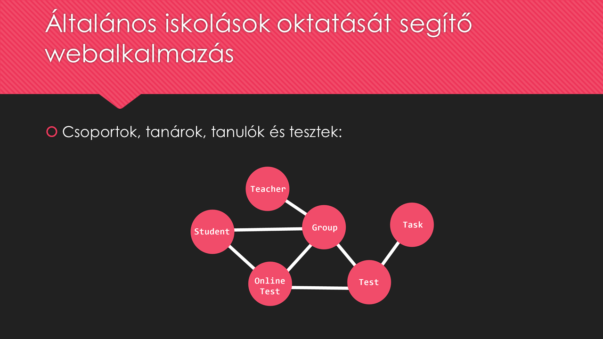
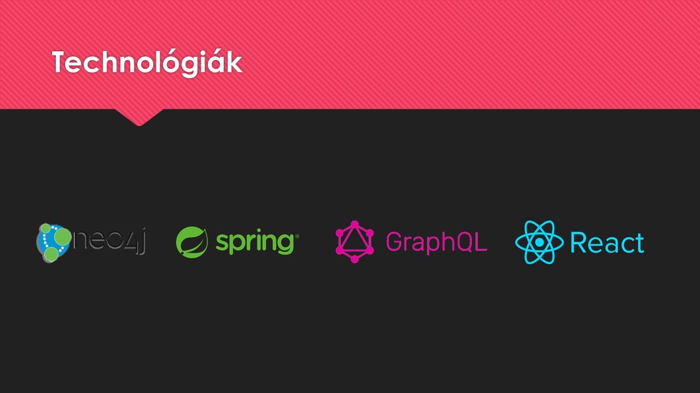
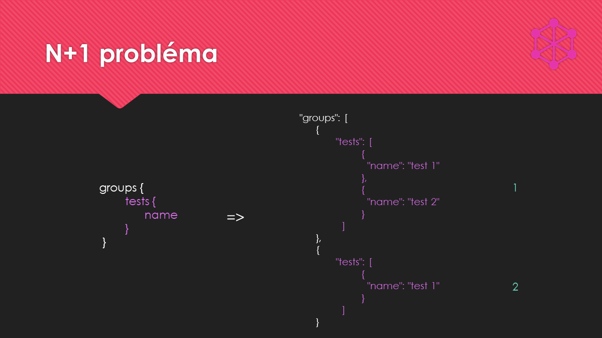
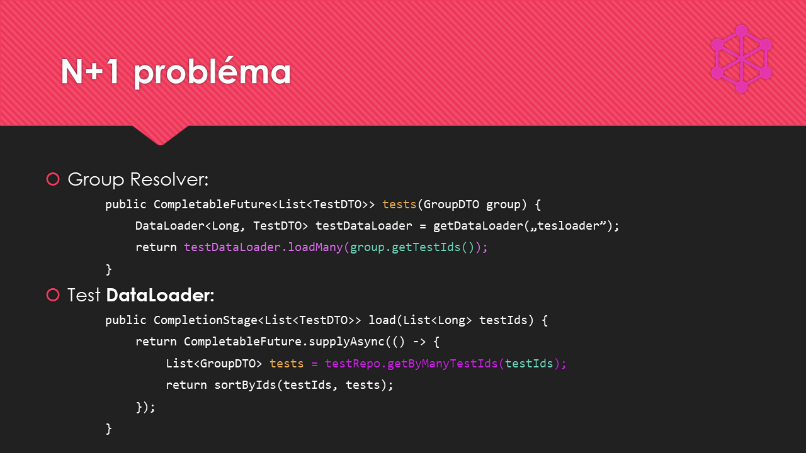
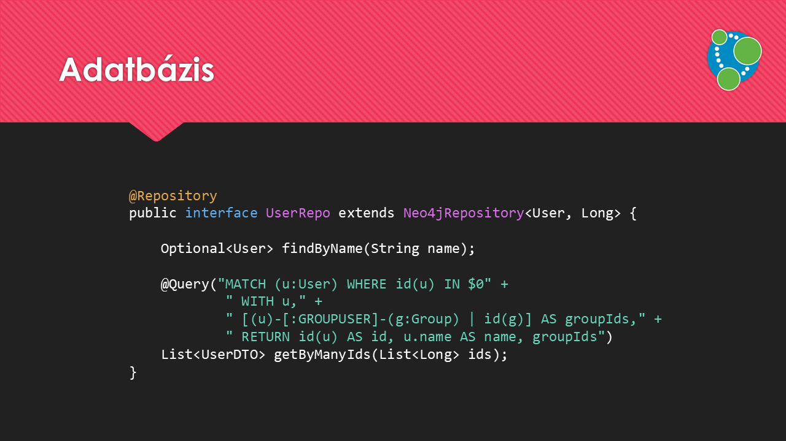
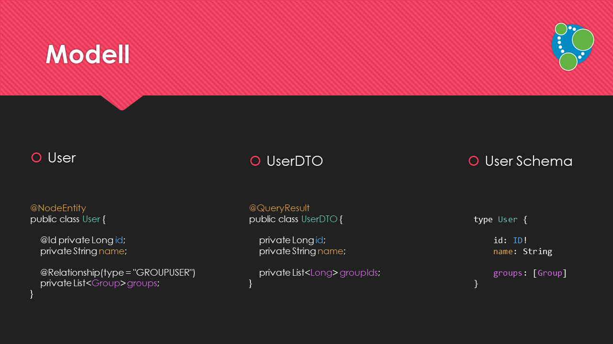
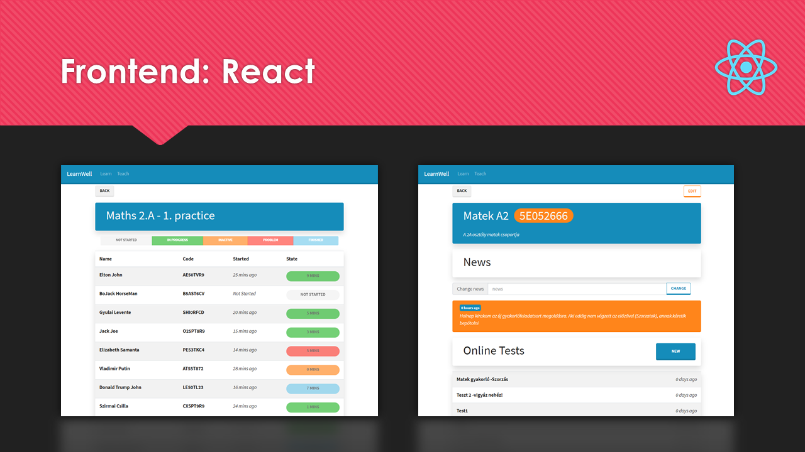

Miklós Gergő 
# Önálló laboratórium dokumentáció

Neo4j + Spring + GraphQL + React

## Feladatkiírás
#### Gyakorló alkalmazás általános iskolások számára
Manapság egyre nagyobb problémát jelent a tanulók egyenlőként kezelése, egyre több szülő kér felmentést tanulási zavarokkal küzdő gyermekének. Mivel minden tanuló eltérő kompetenciával rendelkezik, ezért eltérő figyelmet is igényel.

A feladat egy olyan adaptív gyakorló webalkalmazás készítése, amely lehetővé teszi a tanulók képességeihez alkalmazkodó feladatsorok egyszerű készítését, valamint a tanár (vagy a szülő) számára a tanulók haladásának követését. 

## Bevezetés
Az alkalmazásban minden csoportok köré épül, ezekhez tartoznak a tanulók, tanárok és tesztek. A tanulók teszteket tudnak oldani, a tanárok teszteket tudnak létrehozni és láthatják a tanulók megoldása közbeni állapotait.

A tesztek fő célja nem a tudásfelmérés, hanem a gyakorlás. A kapott feladatok tanulónként egyediek, alkalmazkodnak a tanuló korábbi teljesítményeihez. Ennek alapja az, hogy egy teszten belül a feladatok szintekhez vannak rendelve, és a teszt megoldásához a tanulónak szintugrásokat kell végrehajtania (jelenleg ez még nincs megvalósítva).

Teszteket létrehozni egyszerű, egy nyilvános feladattárból lehet feladatot kiválasztani megadva, hogy a teszt melyik szintjéhez tartozzon.

## Technológiák és architektúra
Egyik alapvető célom a Spring keretrendszerrel való megismerkedés és ezen belül érdekes kihívásnak tartottam REST helyett az egyre népszerűbb GraphQL alkalmazni a kommunikáció megvalósítására, amely segítségével nagyban leegyszerűsíthető a frontend oldali fejlesztés. Az adatok tárolására mindenképpen gráfadatbázist szerettem volna használni a modellben lévő sok, és összetett kapcsolat miatt. Végül a Spring támogatottsága miatt a Neo4j adatbáziskezelőre esett a választás. Fejlesztéskor alapvetően a szerveroldali fejlesztésre szeretném helyezni a hangsúlyt, ezért kliensoldalon a dinamikus tartalmat támogató, de egyszerű React könyvtárat használom.  

# Fejlesztés:
## Backend

### Spring architektúra
Szerveroldalon alapvetően az általános tervezési konvenciókat követtem, azaz három rétegből, a kiszolgálási, az üzletilogika és az adatelérési rétegből áll, Spring keretrendszerre épülve. A Spring modulok sok eszközt nyújtottak számomra a Java alkalmazás fejlesztésekor: függőség injektálást, adatbáziselérés és tranzakciókezelés egységes absztrakcióját, webszolgáltatásokat támogató eszközöket és még sok más mindent.

A gyorsabb alkalmazásfejlesztés érdekében Spring Bootot használtam, ezzel megspórolva nehézkes kézi konfigurációkat.

### GraphQL 
Spring keretrendszerben nagy támogatottsága van az eredetileg JavaScripthez írt GraphQL-nek a GraphQL-Java kreatív nevű könyvtárnak köszönhetően, amely egy teljes előre konfigurált szervert ad a fejlesztőnek. A GraphQL-nek, ha jól használjuk, sok előnye lehet a REST-tel szemben, mert kliensoldalon a séma alapján deklaratív módon pontosan megfogalmazhatjuk, milyen adatokra van szükségünk, ezáltal kevesebb kérés történik, fölösleges adatok nélkül. Azonban mindez a szerveroldalon sok többletmunkával és új problémákkal járhat akár minden területen, ahogy ez velem is történt (jelen előadás nagy része ezért erről is szól), így nem feltétlenül éri meg az alkalmazása.

REST végpontok helyett hasonló feladatot ellátó Query- és MutationResolvereket kell létrehozni, a GraphQL sémában az alkalmazás objektummodelljét meg kell ismételni, valamint ez alapján a modell összes objektumához is Resolvereket kell létrehozni, amelyek feladata, hogy az adott objektumok adattagjait állítsák be.

Tehát a GraphQL-nek bőven vannak hátrányai is, újabb sémaismétlések kellenek, Resolverek miatt bonyolultabb az autentikáció és autorizáció, és megjelenik a jól ismert N+1 Probléma is:

### N+1 probléma
Ha csoportokat és azok tesztjeit szeretnénk megkapni, az REST-tel két külön kérés lenne, de GraphQL-lel csak egy. De mi a probléma a GraphQL kéréssel? Az N csoport összesen 1 adatbáziskérés, azonban a resolverek működése szerint azok tesztjeihez mindegy egyes csoportra egyesével fog megtörténni, ami további N adatbáziskérés. Így a válaszadás akár lassabb is lehet, mint két külön REST kérés (párhuzamosságot figyelembe véve is).

Az N+1 problémára a DataLoader nevű osztály segítségével oldottam meg, amely annyit csinál, hogy összevárja az kéréseket egy kötegbe, és megfelelő időpontban egyetlen egy adatbáziskérésként hajtja végre azokat. Azonban ez további megkötésekkel jár. Esetünkben a csoport objektumoknak előre ismerniük kell a hozzá tartozó tesztek azonosítóját, az  adatbázisnak képesnek kell lennie kötegelt lekérdezésekre és megfelelő sorrendben kell visszaadni a csoportokat, null értékek nélkül.

### Hibakezelés
Alapesetben a GraphQL-Javában végponton keresztül történő kérésre nem tudunk egyedi hibaüzenettel válaszolni, csupán a hibás szintaktikájú kérésre vonatkozó eseményekről értesül pontosan a kliens, minden más esetben (kivételnél) „Internal server error” hibaüzenet jelenik meg, ez az úgynevezett „exception shielding” technika. Erre megoldásként három osztályt kell létrehoznunk: egy saját kivételt, ahhoz egy új adaptert, amely elrejti a kliens elől az érzékeny információkat, valamint egy saját kivételkezelőt is az alap kivételkezelő működését megváltozta úgy, hogy a saját kivételeink is eljussanak a klienshez.

Fontos még figyelembe venni, hogy a REST http válaszaival ellentétben, ha egy GraphQL lekérdezés egy nem kért hibát produkál, attól még kért adatok részlegesen megérkezhetnek, fontos információkat tartalmazva.

### Adatbázis 
A megszokottól eltérően az előadás végére hagytam az adatbázist, ami azzal magyarázható, hogy fejlesztés közben is utólag véglegesítettem azt, leginkább a GraphQL elején még nem ismert sajátosságai miatt.

A gráfadatbázisok lehetővé teszik az ún. „nagy teljesítményű (index free) join” műveleteket, ezért esett végül erre a választásom a relációs vagy dokumentum adatbázisok helyett.

A Neo4j gráfadatbáziskezelőhöz létezik Spring Data implementáció, azaz megfelelő annotációkkal használva automatikus objektum-gráf leképezést kapunk. Egy megfelelő Neo4jRepository interfészből leszármaztatva szintén sok kódot megspórolhatunk, mivel az adatelérési logikát a függvények neveivel adhatjuk meg. Azonban az én esetemben ez nem mindig volt elég, például, ha szükségem volt egy csoport tesztjeinek azonosítójára is (amit a DataLoader megkövetel), akkor a Query annotációval saját Cypher nyelvű lekérdezést kellett megvalósítanom:

Jól látszik, hogy a GraphQL alkalmazása a lekérdezésekre és a DTO-k szerkezetére is kihat, ha az N+1 problémát is megakarjuk oldani. Természetesen mérlegelhetünk is, nem kell minden esetben kötelezően megtennünk, de így tulajdonképpen egy háromrétegű objektummodellel dolgozunk: entitások az adatbázisnak, DTO-k a resolvereknek, valamint a GraphQL séma által meghatározott objektumok a kliensnek.

## Frontend

### Röviden
A frontend oldalról is szeretnénk említeni néhány szót, amely egy single-page aplication, a React könyvtárral megvalósítva. Működésének lényege, hogy a felhasználói felületet egy az úgynevezett virtuális DOM-ban tartja karban, így képes műveletek gyors végrehajtásra. A React alkalmazásom két fő részből, a megjelenítésért felelős komponensekből és a backendhez irányuló kéréseket kezelő szervízekből áll. Ezekhez a kérésekhez a sok funkcióval rendelkező, de egyszerű, Reacthez fejlesztett Apollo Clientet választottam.

## Továbbfejlesztés
Korábban már említett hiányosságok, több feladattípus, autentikáció és autorizáció, mobil, Docker, tesztelés, Redux

## Összefoglalás

Habár még sok fejlesztési lehetőség maradt, azonban mindezt összegezve én úgy gondolom sikerült teljesítenem a kitűzött célokat, valamint rengeteg tapasztalatot szereznem, hiszen az alkalmazott technológiák többségével korábban még nem is foglalkoztam.
